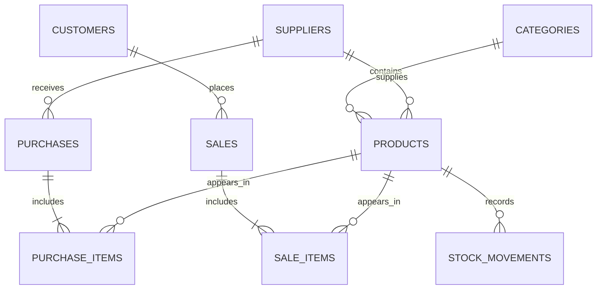

# Entity Relationship Diagram

Categories and suppliers are kept in separate tables so a product stores foreign keys rather than repeated text. Purchases and sales use item tables because one transaction can include many products. Each stock change gets its own movement record for traceability.